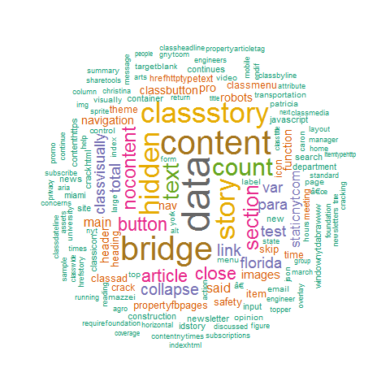

# Creating a Word Cloud
A word cloud is an image that consists of words to describe the how important these words in a certain blogs, articles, books, etc. The size of each word represents the frequency of that word or mostly available word in the article (the word with the highest frequency will be the biggest in the word cloud).

This repository includes R code for creating a wordcloud removing, eliminating special characters and specific words in the document. The wordcloud is created using the article posted on 03/17/2018 in [The New York Times](https://www.nytimes.com/2018/03/17/us/florida-bridge-collapse-crack.html).

